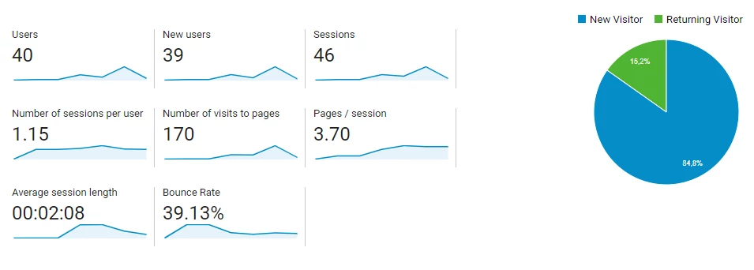

So yeah, I made [vigisur.es](https://vigisur.es). It wasn’t particularly difficult and I had a great time doing it. As the time writing this post, half of the world is locked down, and I decided to take a look and the web and see what could be improved - spoiler: lots of things. As a disclaimer, the website is in Spanish, so if you check it out (which I encourage you to do so for understanding what I'm talking about), don't panic.

# Previous versions

The owner of the business is my aunt. Working with relatives is more often than not an advantage, but it also has its downsides (often they are the same, such as having _way too much confidence_ in expressing a different point of view). The thing is, my aunt told me to build her a proper website for her emerging business. I leave you here a screenshot of the first version of the web, so judge by yourself. If you think it was the ugliest web of the entire planet, welcome to the club.


 _Figure 1: first version of the web._{:.text-center}

It turns out that the web was made by a friend of hers that knew a little bit of "computers" - but nothing about design, clearly. The guy also managed to host the web in a French company called OVH which is the only thing I decided to maintain until now.

Back in 2018, I designed a completely new web with Adobe Muse. Ah, the good-old days before joining university. I didn't know how to write HTML so I took the graphical way, and sure it improved the look (hard not to), but as I see it right now it was kind of a disaster from the functional point of view. I tried to put a  way-back machine link but snapshots don't seem to be working. Fun fact: this website got me a Spa session by my dear aunt, that is her ways of paying favours.


_Figure 2: second version of the web._{:.text-center}

# Current website

I started off with asking her what she wanted and the answer was "something simple, yet convincing". So, I began with templates. One of the downsides of creating a web on your own means that you have to be like *a unicorn*: I had to do the job that a designer, marketing and SEO analyst, programmer, DevOps and QA engineer would do, but I'm fine with all of that as long as the project isn't very big. I asked her if I could release the source code, and while she didn't tell me not to, she didn't sound very convincing so I will assume that I can publish some parts and talk about them, but not the whole codebase.

 I decided using a template because this site is very very static - so static that it's not dynamic at all - and usually templates don't work fine with webs with a lot of functionality such as user's login, dashboards and so on. Besides, the web needn't to be very customized and striking: just "convincing". I used a remix of themes of [Bootstrap made](https://bootstrapmade.com/), specifically 3,

-   [BizPage](https://bootstrapmade.com/bizpage-bootstrap-business-template/)
-   [Squadfree](https://bootstrapmade.com/squadfree-free-bootstrap-template-creative/)
-   [Knight](https://bootstrapmade.com/knight-free-bootstrap-theme/)

If you check them out, you can see that there are elements of the three of them. [Bootstrap made](https://bootstrapmade.com/) *forces* you to leave the link to their web and while I could've removed it, it didn't seem ethical for me, and there is no point in hiding the templates you use.


_Figure 3: current version of the web._{:.text-center}

## Technical decisions

Let's begin with the part in which I explained the choices I made for those who want to reproduce it, are learning web design and want to get inspired by my work or for those who are just interested.

From the **DevOps** perspective, OVH has a very simple and intuitive user interface, which makes managing very *easy peasy*. I changed the DNS configuration and also some hosting configuration  since the web was overall very insecure (DNSSEC disabled, PHP **4.3** (!!!!!!), old SSL certificates, and FTP enabled even when the web isn't in developing mode). OVH also provides email server and I added some spam rules since the inbox was full of it.

From the **design** perspective, I decided to clean up the logo and the branding letters with Photoshop and vectorize them for future enlargement. The web uses some of the photos the templates provide in addition to pictures my aunt provided. Tip: if you need attractive images for a web, try at all costs to go with the customer and shoot some pictures with a good camera: they will drastically improve the quality of the site. The other option is to use stock photos, which aren't as powerful branding as self-made pictures.

I opted for Opens Sans and Monserrat for the typography and consisted colors (the palette consists in #009933 for green, #3BBD67 for light green and no more than shades of grey). Bootstrap is used as main CSS framework.

From the **code** perspective, the templated followed good designs patterns that I chose to continue, such as using IDs for bigger sections such as the "Nuestros clientes" section or the "Contacto" one, and then using these IDs for the selectors inside:

```
    #footer .footer-top {
      background: #111;
      padding: 60px 0 30px 0
    }

    #footer .footer-top .footer-info {
      margin-bottom: 30px
    }
    ...
````

The javascript code is used as-is, I made minor changes in order to get the 3 bits of each template work seamlessly. The **landing page** itself doesn't really have anything besides the common practices: I tried my best to get clean code that is maintainable in the future. The only reason why the index uses PHP is the form, which is of course validated both in JS and in PHP. Regarding the **libraries**, the templates provided a bunch of which I decided to remove and use JQuery (with its extensions like easing, sticky and touchSwipe), Animate on Scroll ([AOS](https://michalsnik.github.io/aos/), with its dependencies) and [Owl carousel](https://owlcarousel2.github.io/OwlCarousel2/) for the "Nuestros clientes" section. A few of them also need their counterparts in CSS and for the icons, [boxicons](https://boxicons.com/) is used. Animations only use the fade-up function from AOS because I thought they show a consistent and cool style.

**Reliability** is also implemented using fallbacks for libraries. The way of implementing is fairly common but the fonts fallback has something interesting to mention. For creating a font fallback, one must copy-paste the link of Google Fonts and download the stylesheet, and then copy-paste again the URLs of each font and replacing those urls for the *.woff2* files in local. This is very simple, yet powerful technique because it will allow the web to offer the same typography even if the Google Font CDN goes down (very unlikely but hey, we never know).

From the **SEO and performance**, I tried to put a lot of emphasis in good behavior in general: one good practice to follow is the use of _async_ tags in the *scripts* tags and in the *links* to css. One key configuration file is the **.htaccess**, which is used in Apache servers in which the webmaster (me hehe) doesn't have access to the **httpd.conf**, which the best way to go since _.htaccess_ slows down web crawlers and browsers. Despite this fact, this is the responsible file for doing the redirections and enforcement of HTTPS, doing so like this:

```
    Options +FollowSymLinks -MultiViews -Indexes
    RewriteEngine on
    RewriteBase /

    # remove www at the beginning of the url
    RewriteCond %{HTTPS} !=on
    RewriteCond %{HTTP_HOST} ^www\.(.+)$ [NC]
    RewriteRule ^ http://%1%{REQUEST_URI} [R=301,L]
```

Note the first three lines, since they are a gotcha's for many *.htacess* files. Be sure to include them in yours if you don't want a lot of headaches. I also cached the files up to 6 months since this site is very very static and the longer the cache lives, the faster the requests will be as long as they don't change (which they won't for sure because im the webmaster hehe):

```
    <FilesMatch "\.(js|html|htm|php|webp|css|ico|pdf|flv|jpg|jpeg|png|gif|swf|mp3|mp4)$">
      Header set Cache-Control "max-age=15552000, public"
      Header unset Last-Modified
      SetOutputFilter DEFLATE
    </FilesMatch>
```

# Conclusion

A fun project to do in these quarantined days. I didn't learn a lot since I already knew most of the things, but the *.htaccess* file was completely new for me. Unfortunately, I can't show much more of that file since it contains sensitive data that shouldn't be exposed. The web page got a fairly good grade in Lightshot (from the Chrome Developer tab), all **As** in [webpagetest.org](https://www.webpagetest.org/) and I used also [Woorank](https://www.woorank.com/es) for the SEO. The latter has to be taken with a grain of salt because it gives bad marks for not having external Facebooks links for instance, stuff that a humble web developer can only little influence. Before the development of this new version, the web had roughly 10/ 12 users per day, and **now it scalated up to 40**, and it's only the beginning since the web hasn't been crawled yet!


_Figure 4: current version of the web._{:.text-center}

Fun fact 2: according to [a post in Quora](https://www.quora.com/What-is-a-reasonable-price-to-pay-for-a-strong-landing-page-design) and [webfx.com](https://www.webfx.com/How-much-should-web-site-cost.html#calculator) this webpage would cost around 1000€ and 6000€, a more than optimistic amount of money, which I probably would set in about ~400€. But hey, nothing is worthier than a sincere "thank you" from your auntie, right?

If you have any question please don't hesitate about emailing me or commenting below!

###### _Peace, Julián._
